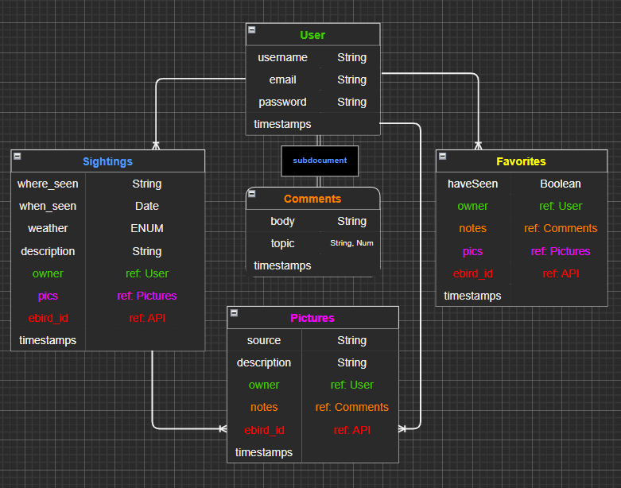
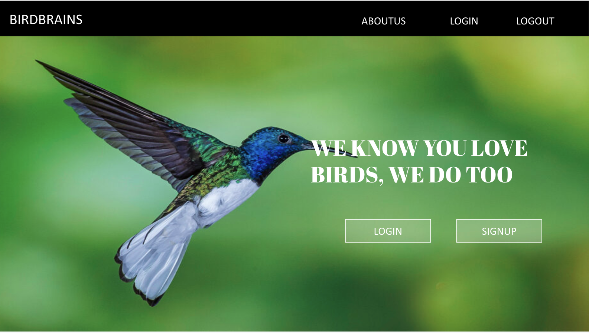

# Bird-client

## Technologies used
<ul>
<li>React</li>
<li>JavaScript</li>
<li>Axios</li>
</ul>

# User story

- User should be able to create an account
- User should be able to create a bird sighting log
    - User will fill in bird name, location, amount of birds and if they have seen or not fields
- User should be able to search for a bird 
    - User will use bird name or location to find birds
- User will be able to leave comments on bird sighting logs
- User will be able to add their own images to bird log

---

## Erd

---

## Wire frame

<a href="https://docs.google.com/presentation/d/1DE21STpf4aIwmSLS2AGdY9T9MXmBdI52lxDonLpo5iY/edit?usp=sharing"> link to wire frames</a>

